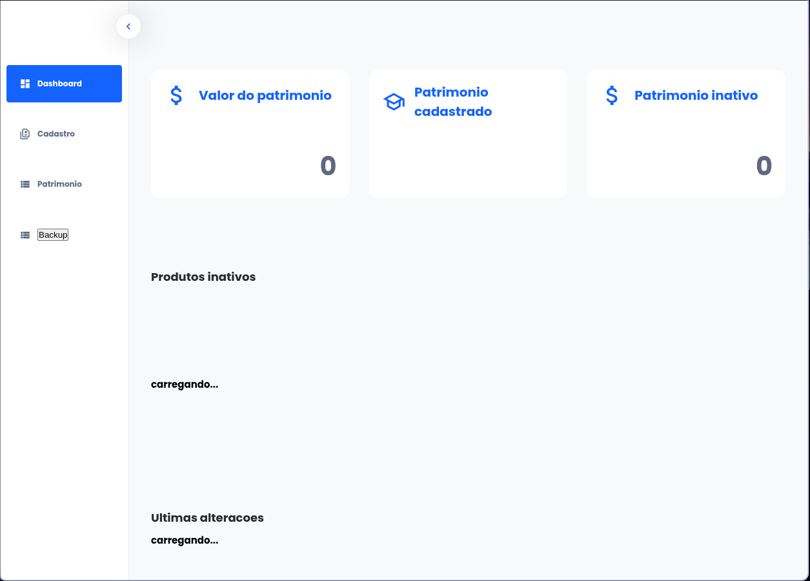

# Projeto Monitoria

O projeto foi desenvolvido para a gestão dos patrimônios da FATEC de Carapicuíba. Ele permite o gerenciamento dos dados dos patrimônios, incluindo a funcionalidades de um CRUD, assim como, associar patrimonios a salas específicas e exportar os dados para um arquivo CSV.

## Descrição

Este projeto consiste em um sistema de monitoria com frontend e backend. O frontend é desenvolvido em React e o backend em Node.js com Express e MongoDB.

## Como Rodar o Projeto

### Backend

1. Clone o repositório:
    ```bash
    git clone https://github.com/GUSTAV0DEDEUS/monitoria.git
    cd monitoria/backend
    ```

2. Instale as dependências:
    ```bash
    npm install
    ```

3. Crie um arquivo `.env` na raiz do diretório `backend` e adicione a variável `MONGO_URI` com a URL de conexão do MongoDB:
    ```env
    MONGO_URI=sua_url_de_conexao_mongodb
    ```

4. Inicie o servidor:
    ```bash
    npm start
    ```

### Frontend

1. Navegue até o diretório do frontend:
    ```bash
    cd ../frontend
    ```

2. Instale as dependências:
    ```bash
    npm install
    ```

3. Inicie o servidor de desenvolvimento:
    ```bash
    npm run dev
    ```

## Estrutura do Projeto

- `backend/`: Contém o código do servidor Node.js.
- `frontend/`: Contém o código do aplicativo React.

## Imagem do Projeto



